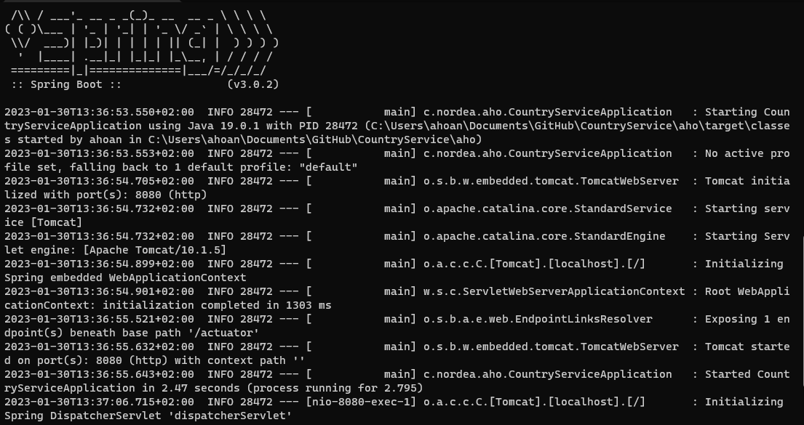
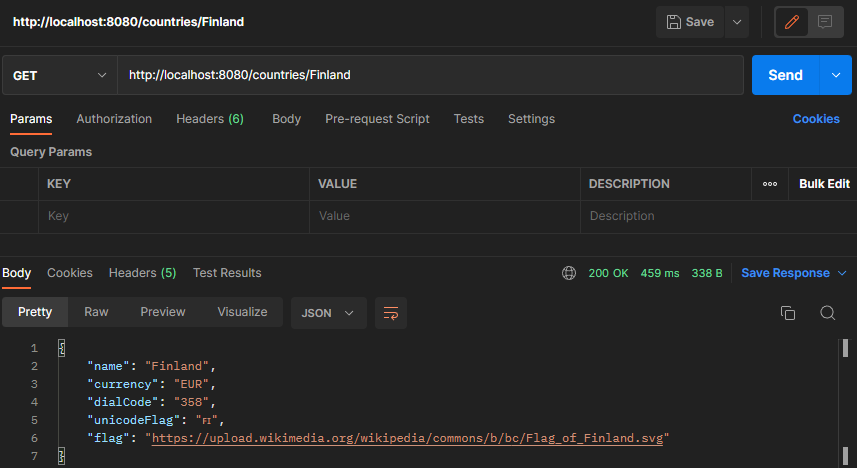

# CountryService
A microservice which provides a list of countries and their information using the https://countriesnow.space service. This project was made as a part of Nordea's recruiting process. The project is built with Spring Boot and Maven.

## Getting started
To run this program on your own computer, follow the instructions below:

### 1. Run the following command in your Command Prompt or GitBash:
```
git clone https://github.com/Anetoni/CountryService.git
```
### 2. Open the /CountryService/aho directory in your Command Prompt or GitBash:
GitHub's default directory for cloning is %USERPROFILE%/Documents/GitHub.
```
cd %USERPROFILE%/Documents/GitHub/CountryService/aho
```
### 3. Run the program with the following command:
```
mvn spring-boot:run
```
***It should look like this:***

### 4. Open the url below on your chosen browser or on Postman (recommended):
```
localhost:8080/countries
```
***It should look like this:***


Postman is recommended due to better formatting:


****In order to get specific country's information, go to the following url:***
```
localhost:8080/countries/name
```
where *name* is your wanted country's name. For example:
```
localhost:8080/countries/Finland
```
would produce this:


## Comments about the project
In this project I didn't manage to include required information such as country code, capital or population to the information regarding a specific country. This was due to https://countriesnow.space/api/v0.1/countries/info?returns= not including the specified information correctly. Instead I decided to showcase the information it provided, such as flag url, currency, dialcode and the flag unicode. 

This project was a great learning opportunity about Spring Boot and its capabilities. The testing of the program is quite basic and lacks automation due to my personal time constraints and lack of knowledge.

Thank you for your time!