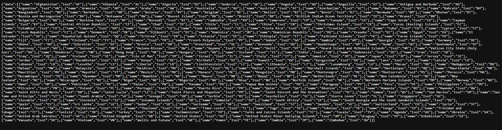
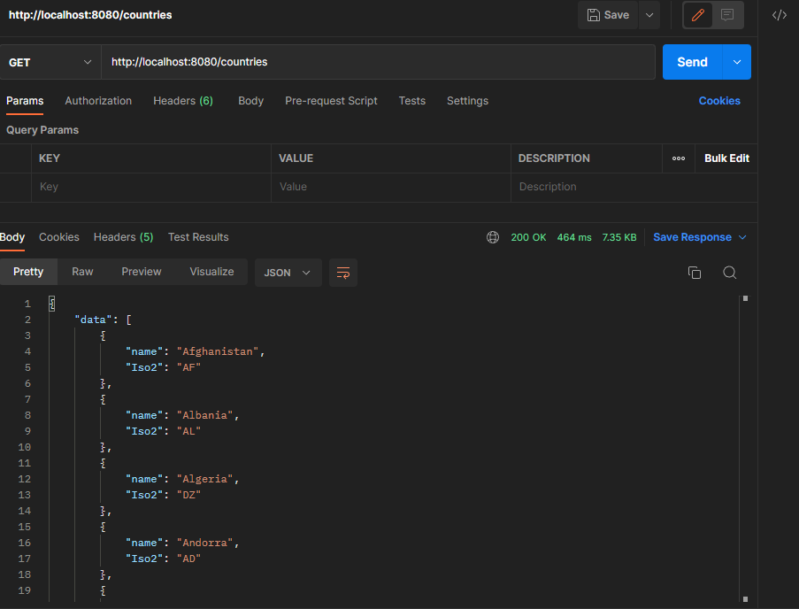

# CountryService
A microservice which provides a list of countries and their information using the https://countriesnow.space service. This project was made as a part of Nordea's recruiting process. The project is built with Spring Boot and Maven.

## Getting started
To run this program on your own computer, follow the instructions below:

### 1. Run the following command in your Command Prompt or GitBash:
```
git clone https://github.com/Anetoni/CountryService.git
```
### 2. Open the /CountryService/aho directory in your Command Prompt or GitBash:
GitHub's default directory for cloning is %USERPROFILE%/Documents/GitHub.
```
cd %USERPROFILE%/Documents/GitHub/CountryService/aho
```
### 3. Run the program with the following command:
```
mvn spring-boot:run
```
***It should look like this:***

### 4. Open the url below on your chosen browser or on Postman (recommended):
```
localhost:8080/countries
```
***It should look like this:***


Postman is recommended due to better formatting:


****In order to get specific country's information, go to the following url:***
```
localhost:8080/countries/name
```
where *name* is your wanted country's name. For example:
```
localhost:8080/countries/Finland
```
would produce this:


## Comments about the project